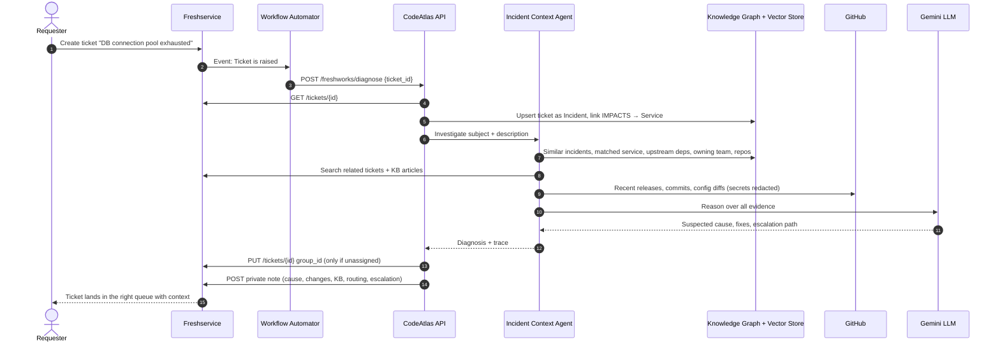
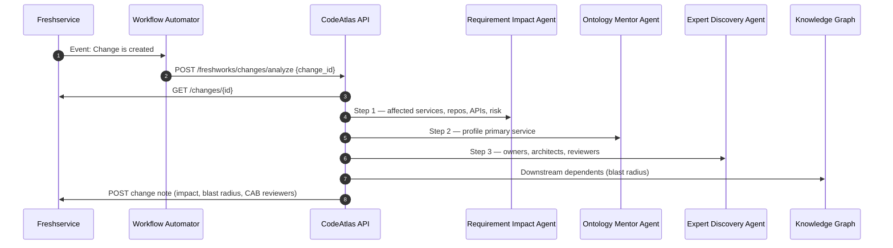

# CodeAtlas AI — Architecture

## 1. System overview

```mermaid
flowchart LR
    subgraph FS["Freshservice (freshworks065)"]
        direction TB
        FST["Tickets / Incidents"]
        FSC["Changes"]
        FSKB["Solutions (KB)"]
        FSG["Groups"]
        FSWA["Workflow Automator<br/>Event → Web Request"]
        FST -- "Ticket is raised" --> FSWA
        FSC -- "Change is created" --> FSWA
    end

    subgraph EXT["Engineering sources"]
        GH["GitHub REST API<br/>releases · commits · config diffs · PRs"]
        LLM["Gemini LLM<br/>(OpenAI-compatible)"]
        REPO["Repository ZIP / public repo"]
    end

    subgraph BE["CodeAtlas Backend (FastAPI)"]
        direction TB
        API["REST API<br/>/api/v1/freshworks/diagnose · webhook<br/>/api/v1/freshworks/changes/analyze<br/>/api/v1/freshworks/sync · /api/v1/analyze"]
        ORCH["Agent Orchestrator<br/>routes query → single agent or pipeline"]
        subgraph AG["8 Specialized Agents"]
            direction TB
            A1["Incident Context"]
            A2["Requirement Impact"]
            A3["Ontology Mentor"]
            A4["Expert Discovery"]
            A5["Architecture Storyteller"]
            A6["Knowledge Gap"]
            A7["Architectural Impact"]
            A8["Document Q&A"]
        end
        CONN["Connectors<br/>Freshservice client · GitHub change client<br/>MCP adapters (Confluence, Jira, Slack…)"]
        ROUTE["Routing & note builders<br/>group auto-assign · secret redaction"]
        API --> ORCH --> AG
        AG <--> CONN
        API --> ROUTE
    end

    subgraph DATA["Hybrid Intelligence Layer"]
        NEO["Neo4j Knowledge Graph<br/>Service · Team · Engineer · Repository<br/>API · Incident · Requirement"]
        VEC["Vector Store<br/>(Chroma / in-memory fallback)"]
    end

    subgraph FE["CodeAtlas Frontend (Next.js)"]
        direction TB
        P1["Home Dashboard"]
        P2["Knowledge Graph"]
        P3["Requirement Analyzer"]
        P4["Repository Intake"]
        P5["Expert Finder"]
        P6["Incident Room"]
        P7["Knowledge Gaps"]
        P8["Freshservice Integration"]
        P9["Agent Activity Log"]
    end

    FSWA -- "POST (via public URL / ngrok)" --> API
    CONN -- "REST v2: read tickets, changes, KB, groups" --> FS
    ROUTE -- "REST v2: post private note · set group_id" --> FS
    CONN --> GH
    AG --> LLM
    AG <--> NEO
    AG <--> VEC
    REPO --> API
    FE -- "/api/v1/*" --> API
```

## 2. Incident flow — ticket raised in Freshservice

## 3. Change flow — change created in Freshservice

## 4. How the menu items map to Freshservice

| CodeAtlas page | Freshservice module | Direction | Status |
| --- | --- | --- | --- |
| Freshservice Integration / Incident Room | Tickets, Solutions, Groups | Both | Live |
| Requirement Analyzer + Knowledge Graph + Expert Finder | Changes | Both | Live |
| Expert Finder | Groups (auto-routing) | CodeAtlas → FS | Live |
| Knowledge Graph | CMDB relationships | Both | Designed — plan does not include CMDB |
| Knowledge Gaps | Solutions (KB), Problems | CodeAtlas → FS | Proposed |
| Agent Activity Log | Private notes as audit trail | CodeAtlas → FS | Live |
